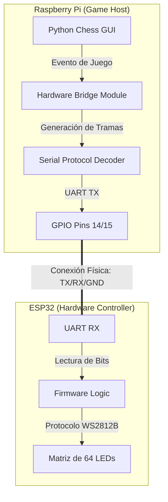

# Plan de Implementación: Sistema de Retroalimentación Física (Raspberry Pi + ESP32)

## 1. Visión General del Proyecto: "Digital-Physical Bridge"

### Objetivo Principal
Sincronizar el estado virtual del juego de ajedrez (proveniente de la librería `chess` y el motor UCI) con una matriz de 64 LEDs direccionables montada en un tablero físico. El sistema utiliza una arquitectura distribuida donde una **Raspberry Pi** actúa como el cerebro (Host) y un **ESP32** actúa como el controlador de hardware (Microcontrolador).

### Alcance
- **Capa de Aplicación (Raspberry Pi)**: Ejecuta la GUI de Ajedrez, interpreta las reglas y decide qué leds deben encenderse.
- **Capa de Comunicación**: Transmisión de tramas de datos seriales (bits) a través de UART desde la RPi hacia el ESP32.
- **Capa de Hardware (ESP32)**: Recibe los comandos seriales, los decodifica y controla físicamente los LEDs NeoPixel/WS2812B.

---

## 2. Arquitectura de Hardware y Comunicación

### A. Diagrama de Flujo de Datos



### B. Especificaciones Técnicas de Comunicación (UART)

| Parámetro | Valor | Descripción |
|-----------|-------|-------------|
| **Baud Rate** | 115200 | Velocidad de transmisión estable. |
| **Protocolo** | 8N1 | 8 bits de datos, sin paridad, 1 bit de parada. |
| **Interface RPi** | `/dev/ttyS0` o `/dev/ttyAMA0` | Dependiendo del modelo de RPi y configuración. |
| **Voltaje** | 3.3V | Nivel lógico nativo para ambos dispositivos (seguridad eléctrica). |

---

## 3. Implementación en la Raspberry Pi (Softare Host)

### A. Instalación de Dependencias
Se deben instalar las librerías necesarias en el sistema operativo de la Raspberry Pi (Linux/Raspberry Pi OS):

```bash
# Actualizar sistema
sudo apt-get update
sudo apt-get upgrade

# Instalar librería serial para Python
pip install pyserial
```

### B. Estructura de "Signal Bits" (Protocolo de Datos)
Para optimizar la velocidad, se enviarán tramas binarias compactas. Cada comando tendrá una longitud fija de bytes:

| Byte | Nombre | Valor/Descripción |
|------|--------|-------------------|
| 0 | **Header** | `0x55` (Sincronización) |
| 1 | **Comando** | `0x01` (Selección), `0x02` (Movimiento), `0x03` (Estado) |
| 2 | **Dato 1** | ID de casilla (0-63) |
| 3 | **Dato 2** | Bits de color/estado (R, G, B comprimido o ID de color) |
| 4 | **Checksum** | Suma de validación para evitar errores de transmisión |
| 5 | **Tail** | `0xAA` (Fin de trama) |

---

## 4. Implementación en el ESP32 (Firmware)

El ESP32 ejecutará un código (C++/Arduino) encargado exclusivamente de:
1. Escuchar el puerto Serial 2 (o el principal).
2. Validar el Checksum de la trama recibida.
3. Aplicar los cambios a la tira NeoPixel.

### Lógica del Firmware (Pseudocódigo):
```cpp
void loop() {
  if (Serial.available() >= 6) {
    byte header = Serial.read();
    if (header == 0x55) {
      byte cmd = Serial.read();
      byte square = Serial.read();
      byte colorInfo = Serial.read();
      byte check = Serial.read();
      byte tail = Serial.read();
      
      if (validChecksum(cmd, square, colorInfo, check) && tail == 0xAA) {
        updateLedMatrix(cmd, square, colorInfo);
      }
    }
  }
}
```

---

## 5. Matriz de Definición de Éxito (KPIs)

| Indicador (KPI) | Definición de Éxito |
| --- | --- |
| **Sincronización Total** | Los LEDs reflejan el estado virtual con 0% de error en posición. |
| **Latencia de Señal** | El tiempo desde el clic en RPi hasta la respuesta del LED en ESP32 es < 10ms. |
| **Integridad de Datos** | Uso de Checksum para ignorar tramas corruptas. |
| **Control Distribuido** | El ESP32 puede manejar animaciones (transiciones suaves) independientemente de la carga de la RPi. |

---

## 6. Próximos Pasos (Roadmap Detallado)

1. **Configuración de RPi**: Habilitar UART vía `raspi-config` y deshabilitar la consola serial por defecto.
2. **Despliegue del Bridge**: Crear `hardware/uart_bridge.py` para manejar el puerto `/dev/ttyS0`.
3. **Mapeo de Casillas**: Definir la tabla de conversión en la RPi para que coincida con el cableado físico del ESP32 (Zigzag o Recto).
4. **Instalación de Firmware**: Flashear el ESP32 con el parser de tramas binarias.
5. **Prueba de Enlace**: Script de prueba en RPi que envíe "ráfagas de bits" para encender todas las casillas secuencialmente.

---

## 7. Esquema Interno de Archivos

- **Raspberry Pi**:
    - `python_easy_chess_gui.py` (Main GUI con hooks)
    - `hardware/serial_sender.py` (Lógica de bajo nivel UART)
- **ESP32**:
    - `src/main.ino` (Lógica de recepción y control WS2812B)
