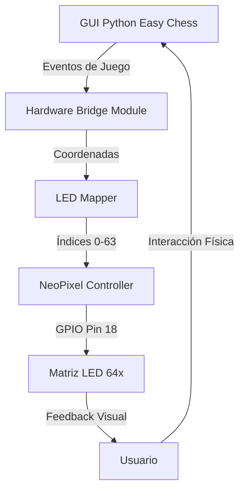

# Plan de Implementación: Sistema de Retroalimentación Física (Hardware Feedback System)

## 1. Visión General del Proyecto

### Objetivo Principal
Sincronizar el estado virtual del juego de ajedrez (proveniente de la librería `chess` y el motor UCI) con una matriz de 64 LEDs direccionables, proporcionando una guía visual en tiempo real en un tablero físico sin necesidad de mirar constantemente la pantalla.

### Alcance
- **Entrada**: Eventos de juego desde `python_easy_chess_gui.py`
- **Procesamiento**: Traducción de coordenadas algebraicas a índices de LED
- **Salida**: Señales eléctricas a LEDs vía GPIO de Raspberry Pi

---

## 2. Arquitectura del Sistema

### A. Componentes Principales



### B. Módulos a Implementar

#### 1. **hardware_bridge.py** (Nuevo)
Módulo principal que actúa como puente entre la GUI y el hardware.

**Responsabilidades:**
- Recibir eventos del juego (`piece_selected`, `move_made`, `ai_move`)
- Gestionar el estado actual de iluminación
- Coordinar la actualización de LEDs

#### 2. **led_controller.py** (Nuevo)
Controlador de bajo nivel para la tira de LEDs.

**Responsabilidades:**
- Inicializar la librería `neopixel`
- Mapear coordenadas algebraicas (e2, e4) a índices seriales (0-63)
- Encender/apagar LEDs individuales o grupos
- Gestionar animaciones (fade in/out, parpadeo)

#### 3. **color_schemes.py** (Nuevo)
Definiciones de esquemas de color para diferentes estados.

**Responsabilidades:**
- Definir colores RGB para cada tipo de evento
- Permitir personalización de esquemas

---

## 3. Eventos a Interceptar en la GUI

### Puntos de Integración en `python_easy_chess_gui.py`

| Evento | Ubicación en Código | Acción LED |
|--------|---------------------|------------|
| **Selección de Pieza** | `play_game()` línea ~2030 (`move_state == 0`) | Iluminar casilla origen (Amarillo) + destinos legales (Verde) |
| **Cancelación de Movimiento** | `play_game()` línea ~2048 | Apagar todos los LEDs |
| **Movimiento del Usuario** | `play_game()` línea ~2098 | Animación de rastro (origen→destino, 200ms) |
| **Movimiento de la IA** | `play_game()` línea ~2328 | Iluminar movimiento de IA (Azul/Rojo, 3s) |
| **Jaque/Jaque Mate** | `play_game()` línea ~2418 | Parpadeo en rojo de rey en jaque |

---

## 4. Especificaciones Técnicas

### A. Hardware Requerido

| Componente | Especificación | Cantidad |
|------------|----------------|----------|
| **Controlador** | Raspberry Pi 3B+ o superior | 1 |
| **Tira LED** | WS2812B / NeoPixel, 64 LEDs individuales | 1 (8 metros aprox.) |
| **Fuente de Poder** | 5V, 3-5A | 1 |
| **Cables** | Dupont, calibre 22 AWG | Varios |
| **Resistencia** | 330Ω-470Ω | 1 (línea datos) |

### B. Configuración de Software

**Dependencias Python:**
```python
# requirements_hardware.txt
rpi_ws281x==4.3.4
adafruit-circuitpython-neopixel==6.3.9
```

**Pin GPIO:**
- **Pin 18 (PWM0)**: Datos para LEDs NeoPixel

### C. Mapeo de Coordenadas

#### Estrategia de Mapeo

Dependiendo del patrón físico de la tira LED:

**Opción 1: Patrón Recto (Straight)**
```
a8→b8→c8→d8→e8→f8→g8→h8
a7→b7→c7→d7→e7→f7→g7→h7
...
a1→b1→c1→d1→e1→f1→g1→h1
```
LED Index = `(7 - fila) * 8 + columna`

**Opción 2: Patrón Zigzag (S-Shape)**
```
a8→b8→c8→d8→e8→f8→g8→h8
h7←g7←f7←e7←d7←c7←b7←a7
a6→b6→c6→d6→e6→f6→g6→h6
...
```
```python
def coordenada_a_led(fila, columna, patron='zigzag'):
    if patron == 'straight':
        return (7 - fila) * 8 + columna
    elif patron == 'zigzag':
        fila_invertida = 7 - fila
        if fila_invertida % 2 == 0:
            return fila_invertida * 8 + columna
        else:
            return fila_invertida * 8 + (7 - columna)
```

---

## 5. Esquema de Colores (Color Coding)

### Definiciones RGB

| Estado | Color | RGB (8-bit) | Descripción |
|--------|-------|-------------|-------------|
| **Pieza Seleccionada** | Amarillo | (255, 200, 0) | Casilla de origen |
| **Movimiento Legal** | Verde | (0, 255, 0) | Destinos posibles |
| **Movimiento Usuario** | Blanco | (255, 255, 255) | Rastro animado |
| **Movimiento IA** | Azul | (0, 100, 255) | Jugada de la computadora |
| **Jaque** | Rojo Parpadeante | (255, 0, 0) | Rey bajo amenaza |
| **Captura** | Púrpura | (200, 0, 200) | Casilla de captura |

---

## 6. Matriz de Definición de Éxito (KPIs)

| Indicador (KPI) | Objetivo | Método de Medición |
|-----------------|----------|-------------------|
| **Sincronización Total** | 100% de coincidencia entre GUI y LEDs | Test manual con 20 jugadas |
| **Latencia de Iluminación** | < 50ms desde evento a LED encendido | `time.perf_counter()` en callback |
| **Claridad de Jugadas** | Usuario distingue 5 tipos de eventos sin mirar pantalla | Encuesta de usabilidad |
| **Persistencia** | LED apagado completo al reiniciar | Verificación visual al inicio |
| **Consumo Energético** | < 2A durante operación normal | Multímetro en línea 5V |

---

## 7. Plan de Implementación (Roadmap)

### Fase 1: Preparación y Prueba de Concepto (PoC)
**Duración Estimada:** 1-2 días

**Tareas:**
- [ ] Determinar patrón físico de la tira LED (straight vs zigzag)
- [ ] Crear script `test_led_corners.py` que encienda esquinas (a1, h1, a8, h8)
- [ ] Validar alineamiento LED-casilla en tablero físico
- [ ] Documentar el patrón correcto en `LED_MAPPING.md`

**Criterio de Éxito:** Las 4 esquinas se iluminan correctamente.

---

### Fase 2: Desarrollo del Controlador LED
**Duración Estimada:** 2-3 días

**Tareas:**
- [ ] Crear `led_controller.py` con clase `ChessboardLEDController`
- [ ] Implementar función `coordenada_a_led(fila, columna)`
- [ ] Implementar métodos:
    - `set_square(square, color)`
    - `set_multiple_squares(squares_list, color)`
    - `clear_all()`
    - `animate_move(from_sq, to_sq, color, duration_ms)`
- [ ] Escribir tests unitarios para mapeo

**Criterio de Éxito:** Poder iluminar cualquier casilla por nombre (ej. "e4").

---

### Fase 3: Integración con la GUI
**Duración Estimada:** 3-4 días

**Tareas:**
- [ ] Crear `hardware_bridge.py` con clase `HardwareBridge`
- [ ] Identificar puntos de integración en `play_game()`
- [ ] Agregar callbacks en eventos clave:
    - `on_piece_selected(square, legal_moves)`
    - `on_move_made(from_square, to_square, is_capture)`
    - `on_ai_move(from_square, to_square)`
    - `on_game_state_change(state)` (jaque, jaque mate)
- [ ] Implementar modo de depuración (simulación sin hardware)
- [ ] Agregar configuración en GUI para habilitar/deshabilitar LEDs

**Criterio de Éxito:** La GUI puede comunicarse con el módulo de hardware sin errores.

---

### Fase 4: Refinamiento y Animaciones
**Duración Estimada:** 2-3 días

**Tareas:**
- [ ] Implementar animaciones suaves (fade in/out)
- [ ] Agregar efecto de "parpadeo" para jaque
- [ ] Implementar "rastro de movimiento" con delay gradual
- [ ] Optimizar consumo energético (brightness adaptativo)
- [ ] Crear esquemas de color alternativos

**Criterio de Éxito:** Las animaciones se ven fluidas y profesionales.

---

### Fase 5: Testing y Documentación
**Duración Estimada:** 1-2 días

**Tareas:**
- [ ] Realizar pruebas de integración completas
- [ ] Documentar instalación de hardware en `HARDWARE_SETUP.md`
- [ ] Crear guía de troubleshooting
- [ ] Grabar video demostrativo
- [ ] Optimización de rendimiento

**Criterio de Éxito:** Documentación completa y sistema funcionando de forma estable.

---

## 8. Estructura de Archivos Propuesta

```
Python-Easy-Chess-GUI/
│
├── python_easy_chess_gui.py          # (Modificado)
├── requirements.txt                   # (Modificado)
├── requirements_hardware.txt          # (Nuevo)
│
├── hardware/                          # (Nuevo directorio)
│   ├── __init__.py
│   ├── hardware_bridge.py            # Puente GUI ↔ Hardware
│   ├── led_controller.py             # Control de LEDs
│   ├── color_schemes.py              # Definiciones de colores
│   └── config.py                     # Configuración hardware
│
├── docs/                              # (Nuevo directorio)
│   ├── HARDWARE_SETUP.md             # Guía de instalación
│   ├── LED_MAPPING.md                # Documentación de mapeo
│   └── TROUBLESHOOTING.md            # Solución de problemas
│
└── tests/                             # (Nuevo directorio)
    ├── test_led_corners.py           # PoC
    ├── test_led_controller.py        # Tests unitarios
    └── test_hardware_bridge.py       # Tests de integración
```

---

## 9. Puntos de Integración en `python_easy_chess_gui.py`

### Modificación 1: Importar Módulo de Hardware

```python
# Línea ~50, después de otros imports
try:
    from hardware.hardware_bridge import HardwareBridge
    HARDWARE_AVAILABLE = True
except ImportError:
    HARDWARE_AVAILABLE = False
    logging.warning('Hardware module not available. LEDs disabled.')
```

### Modificación 2: Inicializar en `__init__`

```python
# En EasyChessGui.__init__ (~línea 720)
self.is_hardware_enabled = False
if HARDWARE_AVAILABLE:
    try:
        self.hardware = HardwareBridge(led_count=64, pin=18, pattern='zigzag')
        self.is_hardware_enabled = True
        logging.info('Hardware bridge initialized successfully.')
    except Exception as e:
        logging.error(f'Failed to initialize hardware: {e}')
```

### Modificación 3: Hook en Selección de Pieza

```python
# En play_game(), línea ~2037 (después de change_square_color)
# Highlight possible moves
for m in board.legal_moves:
    if m.from_square == chess.square(fr_col, 7-fr_row):
        # ... código existente ...
        
        # NUEVO: Actualizar LEDs
        if self.is_hardware_enabled:
            legal_moves_list = [m.to_square for m in board.legal_moves 
                               if m.from_square == chess.square(fr_col, 7-fr_row)]
            self.hardware.on_piece_selected(
                chess.square(fr_col, 7-fr_row), 
                legal_moves_list
            )
```

### Modificación 4: Hook en Movimiento del Usuario

```python
# En play_game(), línea ~2100 (después de board.push(user_move))
# NUEVO: Animar movimiento en LEDs
if self.is_hardware_enabled:
    self.hardware.on_move_made(fr_sq, to_sq, board.is_capture(user_move))
```

### Modificación 5: Hook en Movimiento de la IA

```python
# En play_game(), línea ~2330 (después de board.push(best_move))
# NUEVO: Mostrar movimiento de IA en LEDs
if self.is_hardware_enabled:
    self.hardware.on_ai_move(best_move.from_square, best_move.to_square)
```

---

## 10. Consideraciones de Seguridad

### A. Eléctrica
- ⚡ **Voltaje Correcto**: Verificar que la fuente sea 5V DC estable
- 🔌 **Conexión a Tierra**: Compartir tierra entre Raspberry Pi y fuente LED
- 🛡️ **Protección de Pines**: Resistencia de 330Ω en línea de datos

### B. Software
- 🔒 **Permisos GPIO**: Ejecutar con `sudo` o configurar permisos udev
- 🚫 **Failsafe**: Si hardware falla, GUI debe continuar funcionando
- 📊 **Logging**: Registrar errores de hardware en archivo separado

---

## 11. Próximos Pasos Inmediatos

### Acción 1: Determinar Patrón de LED
**Objetivo:** Identificar si la tira LED sigue patrón recto o zigzag.

**Método:**
1. Numerar físicamente las casillas del tablero (a1=0, b1=1, ..., h8=63)
2. Ejecutar script de prueba que encienda LEDs en secuencia
3. Observar y documentar el patrón real

### Acción 2: Crear Prueba de Concepto
**Objetivo:** Validar que podemos controlar los LEDs desde Python.

**Script:** `tests/test_led_corners.py`
```python
import board
import neopixel

# Configuración
LED_COUNT = 64
LED_PIN = board.D18

pixels = neopixel.NeoPixel(LED_PIN, LED_COUNT, auto_write=False)

# Encender esquinas en colores diferentes
corners = {
    0: (255, 0, 0),    # a1 - Rojo
    7: (0, 255, 0),    # h1 - Verde
    56: (0, 0, 255),   # a8 - Azul
    63: (255, 255, 0)  # h8 - Amarillo
}

for led_idx, color in corners.items():
    pixels[led_idx] = color

pixels.show()
```

### Acción 3: Diseñar Interfaz del Módulo
**Objetivo:** Definir el API del `HardwareBridge`.

**Métodos Principales:**
- `on_piece_selected(square: int, legal_moves: List[int])`
- `on_move_made(from_sq: int, to_sq: int, is_capture: bool)`
- `on_ai_move(from_sq: int, to_sq: int)`
- `on_check(king_square: int)`
- `clear_board()`
- `set_brightness(value: float)`

---

## 12. Recursos y Referencias

### Documentación Técnica
- [Adafruit NeoPixel Guide](https://learn.adafruit.com/neopixels-on-raspberry-pi)
- [rpi_ws281x GitHub](https://github.com/jgarff/rpi_ws281x)
- [python-chess Documentation](https://python-chess.readthedocs.io/)

### Diagramas de Conexión
_(Incluir en documentación final)_

---

## 13. Métricas de Progreso

| Fase | Progreso | Estado |
|------|----------|--------|
| Fase 1: PoC | 0% | Pendiente |
| Fase 2: LED Controller | 0% | Pendiente |
| Fase 3: Integración GUI | 0% | Pendiente |
| Fase 4: Animaciones | 0% | Pendiente |
| Fase 5: Testing | 0% | Pendiente |

**Última Actualización:** {{ fecha_actual }}

---

**Autor:** Sistema de Planeación Técnica  
**Versión del Documento:** 1.0  
**Fecha de Creación:** 2025-12-27
